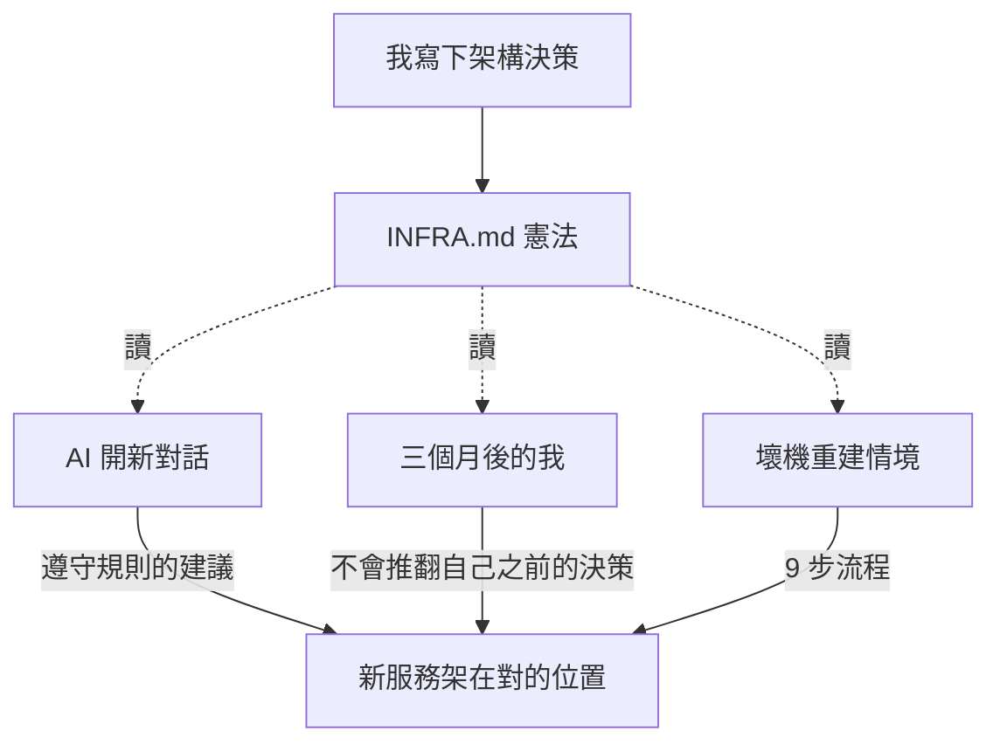

+++
date = '2026-05-07'
draft = true
title = '【小白篇】NAS 憲法：寫一份說明書，讓 AI 不會把家拆了'
description = '一份不會忘記的家規，給三個月後的自己、給每次新開對話的 AI'
tags = ['NAS', 'homelab', 'AI協作', 'INFRA.md', '小白篇', '架構']
mermaid = true

# TODO: 配封面圖（建議：藍圖、規則、條文的視覺；或 INFRA.md 在 VS Code 的截圖碼掉敏感欄位）
# [cover]
#   image = 'cover.jpg'
#   alt = 'INFRA.md 一份檔案的特寫'
+++

## 一份檔案的宣言

我 NAS 上有一份叫 `INFRA.md` 的檔案，第一行就直接把這份檔案的角色講清楚了：

**這份文件是這台 NAS 的唯一真實來源。壞了就照這裡重建。**

它不是 README、不是事後寫的補充說明、不是給人看著好玩的註解。它是這台 NAS 真正的設定圖。297 行，列了硬體規格、磁碟配置、6 條「不」字規則、9 步壞機重建 SOP。

上一篇我寫到把 SSH key 交給 AI——它能進來了。但**進來之後它知道這個家裡哪些地方不能踩嗎**？

不知道。所以我幫它（也幫未來會忘記的我自己）寫了一份家規。這篇就是在講這份家規長什麼樣、為什麼需要它、AI 怎麼讀它。

---

## 兩種失憶

寫這份文件的動機，源自我發現自己會在兩個情境下失憶。

### 失憶一：三個月後的我

三個月前我把 Immich 的 PostgreSQL 設定成放 SSD（在 `/opt/immich/postgres/`）而不是 HDD。當時我有想清楚原因——HDD 沒辦法 spindown（一直被資料庫喚醒就一直在轉）、效能也跟不上資料庫的高頻讀寫。

三個月後再看到這個設計，我只記得**「好像有原因」**。

如果我那時沒寫下來，下次想加新服務的時候，我可能會直接照著「最普遍的做法」設定——把 DB 隨便丟一個位置——然後一邊用一邊納悶為什麼 HDD 老是醒著。

**沒寫下來的決策，等於沒做的決策。** 因為下一次的我會把它推翻、或者乾脆不知道有過這個決策。

### 失憶二：AI 每次都是新人入職

跟 AI 開一個新對話，等於它從零開始。

它不知道你 NAS 有三顆盤、不知道你 DB 在 SSD、不知道你用 Docker Compose、不知道你有 INFRA.md 規則。你不講清楚，它就會用「最普遍的做法」給建議——而你要的是**你的做法**。

第一次我跟 AI 說「幫我加一個服務」，它建議「把 PostgreSQL 用 Docker volume 預設位置」。聽起來合理對吧？但跟我的設計衝突——我規定 DB 要放 `/opt/<service>/` 在 SSD 上。

不是 AI 笨，是它沒拿到地圖。

於是我發現一件事：**我需要的，是一份「能同時治癒兩種失憶」的東西**——讓未來的我跟新對話的 AI，都能花十分鐘看完，就懂這台機器的設計邏輯。

那就是 INFRA.md。

---

## 憲法長什麼樣（拉三段給你看）

整份檔案 297 行不適合塞進這篇。挑三段最有代表性的給你看，你就能感覺到它在做什麼事。

### 一張表交代「這台機器是誰」

開頭一張硬體表：主機名、CPU、RAM、OS 版本、區網 IP、Tailscale IP、UPS 型號。
接著一張磁碟表：哪顆裝置掛在哪、用途是什麼、有沒有設 spindown。

這兩張表加起來大概 20 行，但讀者（無論是未來的我或新對話的 AI）讀完，這台機器的「身體輪廓」就清楚了。

### Volume 放置原則：把硬碟分工變成規則

第一篇我寫了三顆硬碟的分工——SSD 跑系統＋資料庫，HDD 放媒體，舊盤做備份。那篇是用「故事」講這套設計，這篇是把它變成**條文**：

| 類型 | 放哪 | 原因 |
|---|---|---|
| 資料庫（PostgreSQL 等） | `/opt/<service>/`（SSD） | 效能高、HDD 一直被喚醒就無法 spindown |
| 媒體 / 上傳檔案 | `/data/<service>/`（HDD） | 容量大，不需要高 IOPS |
| compose 設定 / 程式碼 | `/data/services/<service>/` | 統一位置，能跟著 rsync 一起備份 |

這張表往下看是有威力的。它把第一篇感性的「我覺得這樣比較好」變成「下次新增服務時就照這個位置擺」——是一個能直接套用的規則。

下次我加新服務、或下次 AI 幫我寫新 compose，這張表是兩邊唯一要遵守的東西。

### 六條「不」字規則：踩過的坑做成圍籬

這是我最喜歡的一段，列了我這台 NAS 的六條禁忌：

1. `/data` 的根目錄不亂丟散檔，所有東西要先想好歸屬、進對的子目錄
2. `/backup` 是凍結區，rsync 自動寫、人不要直接碰
3. 服務的資料庫不能落在 HDD 上，必須放 SSD
4. 服務原則上一律用 Docker，不在系統層 `apt install`
5. 任何機密（密碼、token、API key）絕不寫進 `docker-compose.yml`，必須走 `.env`
6. Samba 只開放需要的子目錄，不對整個 `/data` 開門

每一條後面都有踩過的坑或者想到的後果。但這篇不會把六條全展開——挑兩條來看。

第三條（DB 不放 HDD）就是上一節「三個月後我會忘記」那個故事的條文版。把感性的決策變成永久的規則。

第四條（一律 Docker、不 `apt install`）特別有意思——因為**它有兩個例外**。下一節要講這件事。

---

## 規則的例外：code-server 跟 Windows VM

我規定「服務一律用 Docker」，但翻 INFRA.md 的「系統服務」那節，有兩個東西明顯不符合這條規則：

**例外一：code-server 跑 systemd user 服務**

code-server 是讓我用瀏覽器打開「跑在 NAS 上的 VS Code」，要存取我的家目錄、要載入各種開發工具鏈、要在我每次儲存時頻繁 reload。

包進 Docker 要解決一堆難搞的事：home 目錄怎麼 mount 才不會權限衝突？開發環境的工具鏈怎麼進到容器？頻繁 reload 怎麼處理？算下來複雜度暴增、能省下的東西很少。

所以它跑 systemd user 服務（讓 systemd 用我的使用者身分管它），不進 Docker。

**例外二：Windows 11 VM 跑在 KVM**

我有一台 Windows 11 VM 給特定 Windows 軟體用。Windows VM **不可能**包進 Docker——因為 VM 跟容器是兩種不同的東西。VM 是一台「軟體模擬出來的整台電腦」，連 BIOS、kernel 都自己一份；Docker 容器是「共用主機 Linux 核心的隔離程序」。

你不能把一台「整台虛擬 Windows 電腦」塞進「共用 Linux 核心的程序」裡——原理上做不到。

### 兩個例外背後的同一個道理

寫到這裡就有意思了。這兩個破例不是因為我懶，是因為**規則是寫來服務目的的，不是反過來**。

「能 Docker 就 Docker」這條規則的**目的**是「讓服務統一管理、好備份、好重建」。當套用規則本身會破壞這個目的時——硬包 code-server 會讓它更難維護、Windows VM 根本沒辦法 Docker——那破規則就是正確答案。

我寫憲法不是為了把自己關進框框。是為了讓自己**知道破例時在破什麼精神**。

沒規則就沒例外，只有混亂。有規則才有「為什麼這條我不照」這個誠實的判斷。這個東西，不寫下來是想不清楚的。

---

## AI 怎麼讀這份憲法

回到「AI 協作」這條主線。

上一篇講把鑰匙交給 AI——它能進來了。但**進來之後我怎麼確保它不會把家拆了**？

答案是：**把這份憲法當作每次新對話的「第一份背景」**。

我每次開一個新的 ClaudeCode 對話，第一件事不是直接問問題，是先說：「請先讀 `/data/services/nas-dashboard/INFRA.md`。」

它讀完，這台機器的所有規則就裝進它腦袋了。接下來不管我問「幫我加一個新服務」、「幫我看看備份哪裡有問題」、「幫我規劃下一步要做什麼」——它的建議都跟我的設計**不打架**。

舉個對比：

- 沒餵 INFRA.md 時 AI 給的建議：「用 Docker 預設的 PostgreSQL volume，放在 `/var/lib/postgresql/data/`」
- 餵了 INFRA.md 之後給的建議：「按你的規則放 `/opt/<service>/postgres/`，因為你 DB 都在 SSD 上跑、HDD 是給媒體用的」

不是 AI 變聰明了。是它從「在猜你的設計」變成「直接讀你的設計」。

這份 INFRA.md 等於是「**三個讀者的共同記憶體**」——未來的我、AI、還有壞機重建時的那個倉皇的我。

---

## 壞機重建：文件即基礎設施的終極考驗

INFRA.md 的最後一節是九步壞機重建 SOP：

1. 重裝 Ubuntu，把 `/data` 跟 `/backup` 兩顆 HDD 重新掛回去
2. 安裝基本套件（Docker、Cloudflared、Tailscale、UPS 監控）
3. 啟動 Tailscale，讓這台機器重新進到我的私網
4. 從備份盤的最新 snapshot 裡把各服務的 `.env` 取回來
5. 一個一個把服務起回來
6. 恢復 Cloudflare Tunnel 設定
7. 恢復 code-server 的 systemd user 服務
8. 恢復 UPS 監控
9. 確認備份 cron 還在跑

每一步都不展開。但九個標題加起來有種份量——**這份文件居然連「我不在場、整台機器壞掉」的時刻都能撐住**。

我自己一定記不住這九步。我會忘記順序、忘記哪個套件叫什麼名、忘記 systemd user 的 enable 指令。但 INFRA.md 不會忘。

換句話說，這份檔案有一個我寫的時候沒想清楚、但寫完才意識到的功能：**它是一份「我消失的時候 NAS 怎麼活下去」的劇本**。

寫文件不是為了現在的我。是為了那個未來不在場的、慌張的、忘了東西的、新對話的我自己——還有 AI。

那份重建 SOP 的細節我留給之後另一篇文章專門講，這裡先點到。

---

## 憲法的「第 0 條」

寫到最後我發現一件事——INFRA.md 沒明寫，但其實有一條**第 0 條**。

那就是：**選對地基。**

為什麼選 Ubuntu Server，不選 TrueNAS 或 Unraid？
為什麼用 Tailscale 連線，不開 port forwarding？
為什麼全用 Docker，而不依賴 NAS 專用 OS 的特殊功能？

這些更基礎的選擇，是這份憲法**寫得出來的前提**。地基選錯了，後面寫什麼規則都是空的。

下一篇要講的就是這條第 0 條的第一個面向——我為什麼選 Ubuntu Server，不選那些聽起來更專業的 NAS 專用 OS。

---

## 文件不是給看的

這篇收尾我想說一件事。

我們常以為「寫文件」是個義務、是個負擔、是「寫完代表事情做完了」的儀式。

但這套 NAS 教我一個翻轉的觀點：**文件不是給看的，是讓事情能持續發生的一部分**。

INFRA.md 寫下來之前，我的設計只存在於我當下的腦袋裡——下一秒就開始衰退。寫下來之後，那些決策變成可以被三個讀者反覆讀取的東西：

- 未來的我（避免推翻自己）
- 每次新對話的 AI（避免重新猜測設計）
- 壞機重建時的我（避免從頭想流程）

每一條規則，是一份不會忘的記憶。

這就是為什麼我願意花時間維護它——不是為了給別人看，是為了**讓這台 NAS 能在我不在場的情境下還活著**。

---

## 想自己也寫一份 INFRA.md？跟 AI 這樣說 →

> 「請進到我 NAS 上掃一遍：每個服務跑在哪、用什麼 image、資料庫放哪、有什麼定期任務、安全設定怎麼做的，整理成一份 INFRA.md。我之後每次開新對話會先給你看這份檔案，請以它為設計準則。」

前提：你已經給 AI 一把 SSH key（→ 上一篇講過）。它會自己進去掃、整理、回報。你看完一遍補上「我心裡有但檔案沒提到的決策」就完成了。
