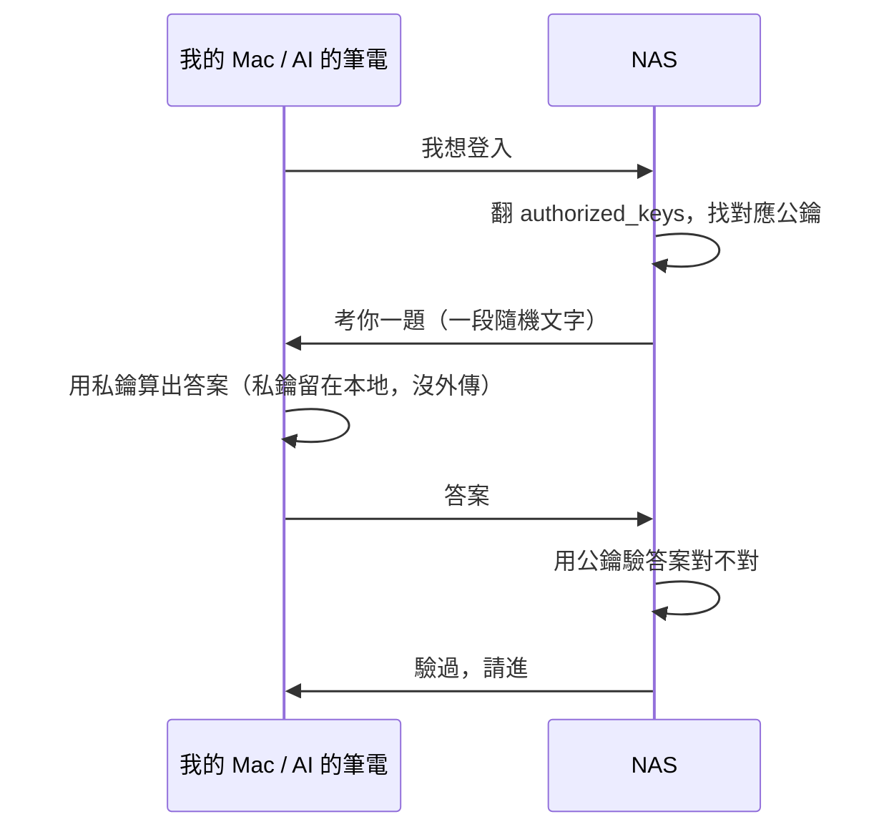

+++
date = '2026-05-10'
draft = false
title = '【小白篇】SSH Key 是什麼：兩把家裡的鑰匙，我跟 AI 共用'
description = '一份只有兩行的白名單，兩把人跟 AI 共用的家裡鑰匙——關於信任、撤回、與裝置入口的故事。'
tags = ['NAS', 'homelab', 'SSH', 'AI協作', '小白篇', 'Linux']
mermaid = true

[cover]
  image = 'cover.jpg'
  alt = '兩把形狀不同的鑰匙、用白繩綁在一起、放在大理石檯面上'
+++

## 兩把鑰匙

我 NAS 的鑰匙圈，有兩把鑰匙。

它們躺在一個叫 `~/.ssh/authorized_keys` 的檔案裡，大概長這樣：

```
ssh-ed25519 AAAA...一大串字母... gurry@MacBookAir.home
ssh-ed25519 AAAA...一大串字母... ClaudeCode@GakePC
```

第一行——我的 Mac。
第二行——我的 PC。

上一篇說「跟 AI 討論架構」，講得有點抽象。

具體場景其實長這樣——我跟 AI 說「幫我看一下 NAS 上每個服務的設定檔長怎樣」。

它會**自己拿著上面的 key**、自己 ssh 連進去、進到對應的資料夾、把檔案打開讀。

整理完，把結果回報給我。

> **等等，什麼是 SSH？**
>
> 簡而言之：SSH 是「從電腦遠端進到另一台機器命令列」的工具。Mac 打開終端機輸入像 `ssh gakes@nas` 這種指令，從此你下的每個指令都跑在那台 NAS 上、看到的每個結果也都是那台 NAS 回應的。對 NAS 這種放角落、平常沒接螢幕的無頭騎士，SSH 就是日常管理的主要入口。
>
> 第一次摸 SSH 通常會卡兩個地方：要 ssh 到「哪個 IP / 主機」、跟「用密碼還是 key 認證」。這篇主要回答的是後者；至於前者：例如為什麼我都 ssh 到 Tailscale 的 100.x.x.x、不直接 ssh 到公網 IP 則留到後面講 Tailscale 的那篇。

所以兩台機器上都有 AI 在幫我用 SSH 管理 NAS。**我跟 AI 共用這些鑰匙**，我們在那台機器上應該也算是同居關係吧。

這篇要來分享幾個我自己玩到 SSH key 才搞懂的小白問題：
1. 到底什麼是 SSH key？
2. 為什麼有它就不用密碼？
3. 給AI使用這些鑰匙不會超危險嗎？
4. 為什麼是兩把不是一把？

順便講一下我把 NAS 的密碼登入完全關掉，是出於什麼考量。


---

## 到底什麼是 SSH key？
### 密碼是「你知道的」，鑰匙是「你擁有的」

SSH key 跟密碼最根本的差別，不在於誰比較安全，而是它們**驗證身分的方式不一樣**。

密碼的邏輯是：「能說出 PIN 碼的就是本人」——驗證你**知道什麼**。
SSH key 的邏輯是：「能用這把鑰匙簽名的就是本人」——驗證你**擁有什麼**。

更具體一點。SSH key 是一對成對的金鑰：一把「公鑰」、一把「私鑰」。

- **公鑰**：像一把門鎖。NAS 把它記在 `authorized_keys` 裡，意思是「這個形狀的鑰匙我認識」。公鑰可以大方丟給別人看，反正打不開門
- **私鑰**：像你口袋裡那把實體鑰匙。它從來不離開你的設備。每次要登入時，本地系統用私鑰「簽一個名」，證明「我手上這把跟你那個門鎖是配對的」

於是登入過程像一場「考試」：NAS 出題（給你一段隨機文字）、你的設備用私鑰算出答案、NAS 用公鑰驗答案對不對。**整段你的私鑰沒離開過你的設備**——「值得偷走」的東西根本沒上網。

看圖會更直觀：



這就是 SSH key 為什麼比密碼安全的根本——**過程裡沒有秘密在傳遞**。

---

## 三個我卡關的問題

第一次接觸 SSH key 的時候，這三個問題在我腦袋裡轉了好幾圈。如果你也在轉，下面也許有你要的答案。

### Q1：為什麼有 SSH key 就能免密碼？

因為 NAS 上那個 `authorized_keys` 檔案，本質上就是一份**白名單**。

寫在上面的公鑰 → 對應的私鑰能進來。
名單沒你 → 一輩子別想進來。

認證方式從「**對不對**」（密碼正確嗎）變成「**有沒有**」（你在名單上嗎）→ 「密碼」這件事自然不再需要。

> **這個 key 跟 GitHub 那個 SSH key 一樣嗎？**
>
> 他們是一樣的技術、但不同的白名單。
>
> 如果你之前為了 `git push` 設過 SSH key、把公鑰貼進 GitHub，那就是 GitHub 自己的白名單。NAS 的白名單是它**自己**那個 `authorized_keys` 檔。兩個各自管自己。

### Q2：進得了 NAS 之後，是不是就再也不用密碼了？

不是。SSH key 只解決了「**進門**」這條路；進來之後想動系統，系統還是會問密碼。

家裡不只一道鎖。譬如裝新軟體、改設定、停某個服務這類「會動到系統」的事，系統會再問一次密碼，確認你是不是主人。

> **這個「再確認」機制叫 sudo**
>
> Linux 上凡是會動到系統的指令，前面要加 `sudo`，才能以管理員身分執行（譬如 `sudo apt update` 就是「用管理員身分更新軟體」）。每次跑都會再問一次系統密碼——避免你手滑誤操作系統。

換個比喻：SSH 是進家門，sudo 是動家裡的保險箱。
進家門用鑰匙，那就不用按密碼鎖了。
但要打開保險箱、動裡面的東西，主人還是要輸入保險箱密碼。

所以 **「進門」跟「動系統」是兩條獨立的軌道**，前者免了不會讓後者跟著免掉。

> 稍後段[「順手把密碼登入關掉」](#順手把密碼登入關掉)會把「進門用密碼」這條路徹底封鎖，關的就是進門那條，sudo 時還是需要密碼。

### Q3：那不是很危險嗎？誰都能拿 key 進來？

「拿 key 進來」這個動作其實有兩關擋著。

一是 key 本身——**暴力試不出來**。它的可能性是天文數字，用全宇宙的算力試到宇宙熱寂都試不完。拿不出對應私鑰，敲不出 NAS 認得的簽名。

二是白名單——**你自己控制的清單**。
想踢一個人出去？刪那一行就好。
想加一台設備進來？把對方的公鑰貼進去。

真正會危險的不是這兩關有漏洞——是「**你的私鑰被偷**」（不是被試出來，而是被拿走）。所以好習慣是：

- 私鑰絕對不能放在會被別人看到的地方（不要傳到 git、不要 email 寄、不要丟到雲端）
- 設備要有開機密碼或 Touch ID，鎖住才能讀取私鑰
- macOS 可以把私鑰交給 Keychain 管，加一層保險

但說起來，這比管理密碼**容易很多**——密碼要記、不重複、還要定期改；私鑰待在原地、就一直安全。

---

## 第二行：撤回的單位是「裝置」、不是「角色」

回頭看那兩行 key，有一個技術細節值得攤開。

SSH 在驗證的時候**只認公鑰本體**；`ClaudeCode@…`、`gurry@…` 這種 comment 是給人看的標籤，SSH 不檢查。

所以兩把 key 各自代表的是「**那台機器的入場券**」，綁的是裝置、不是「人」或「AI」這種角色。誰拿著對應私鑰過來不重要，不管是 ClaudeCode 在跑、還是我在打字，NAS 一律當作「那台裝置」放行。

撤一把 key，就是踢一台裝置。刪掉 GakePC 那一行，整台機器不再可信任：AI 進不來、我從那台機器也過不來；但 Mac 那條路完全不受影響。

這對 AI 協作有意思的地方在於：**「我信任 AI 嗎？」這個哲學問題不用回答；只要回答「我信任 GakePC 嗎？」就夠了**。

從抽象的角色變成具體的機器。**信任這件事，從此有了單位、可以指認**。

---

## 順手把密碼登入關掉

既然 key 進得來、用不到密碼，那條密碼登入的路乾脆關掉。

NAS 上一個叫 `/etc/ssh/sshd_config.d/99-security.conf` 的小檔案，裡面只有兩行：

```
PasswordAuthentication no
PermitRootLogin no
```

第一行：禁止用密碼登入（只接受 SSH key）。
第二行：禁止 root 使用者直接登入（要進系統先進普通帳號、有事再 sudo）。

為什麼要關掉密碼這條路？

全世界有非常多的腳本，一秒幾百次掃 SSH 22 port 試弱密碼。你只要 SSH 對外開、又用密碼登入，那些腳本就會慢慢試 `admin / 123456`、`root / password`、`abcd / 1234`⋯⋯總有一天會踩中。

把密碼這條路關了，等於是不接受任何敲門聲：它們可以掃到天荒地老，門根本就不會回應密碼。

> ⚠️ **先確認你的 key 真的進得來、再把密碼登入關掉**。順序反了會把自己鎖在門外哦。

我做的時候是這樣：

先用 key 登入一次成功。

開另一個視窗、再用 key 試一次成功。

確認沒問題了，才把上面兩行寫進去、重啟 SSH 服務讓設定生效。

> 不小心失敗的話，就得幫無頭騎士(NAS)，裝上螢幕鍵盤進去重設了（笑

這還只是 SSH 一個面向。整套 NAS 的安全加固還有 UFW（防火牆）、fail2ban（自動封鎖嘗試入侵者）等等，但那些是另一篇的事。

---

## AI 進來都做什麼

很多人問我「給 AI 權限是不是超危險？」

我的回答是「看你給多少、給的權利能不能撤回」。

ClaudeCode 進來，我們的分工是這樣：**我拆問題、定範圍、做判斷；它處理技術、跑腿、起草**。

譬如寫這篇文章時，我心裡想的是「我要知道每個服務怎麼跑、磁碟為什麼快滿」

這是我拆出來的問題。它接著 ssh 進去、查磁碟、看 log、把零碎資訊整理成可讀的報告給我。

譬如要加新服務時，我會說「我要加一個 X、按 INFRA.md 規則來」

這是我授權的範圍。它讀完 INFRA.md 後比對規則、生出設定檔；判斷符不符合需求、要不要部署，是我自己看完才決定。

它偶爾會誤解我的需求、漏看哪條規則。但因為它做的是「**跑腿與起草**」、不是「替我做主」，看到不對的擋掉就行，後果有限、可逆。

也是因此我才放心讓它進來：**信任之所以能交出去，是因為它本來就可以收回**。

下一篇要講的就是這件事的另一面：**光把門打開還不夠**。AI 能進來，不代表它絕對不出錯：它需要一份「家規」，知道我這個家裡哪些地方不能踩。

那份家規就是下一篇要寫的〈NAS 憲法〉。

---

## 想讓自己的 AI 進 NAS？跟 AI 這樣說 →

不用記指令。打開 ClaudeCode（或任何能執行命令的 AI），**先告訴它你 NAS 的 IP（或主機名）跟登入帳密**，然後跟它說：

> 「幫我在這台筆電上生一把 SSH key（用 ed25519），告訴我怎麼把公鑰加進我 NAS 的 authorized_keys。順便幫我把 NAS 的密碼登入關掉，**但記得先確認 key 進得來再關**。」

你只要記住三個關鍵詞：**SSH key**、**authorized_keys**、**密碼登入**——AI 會帶你做完。
