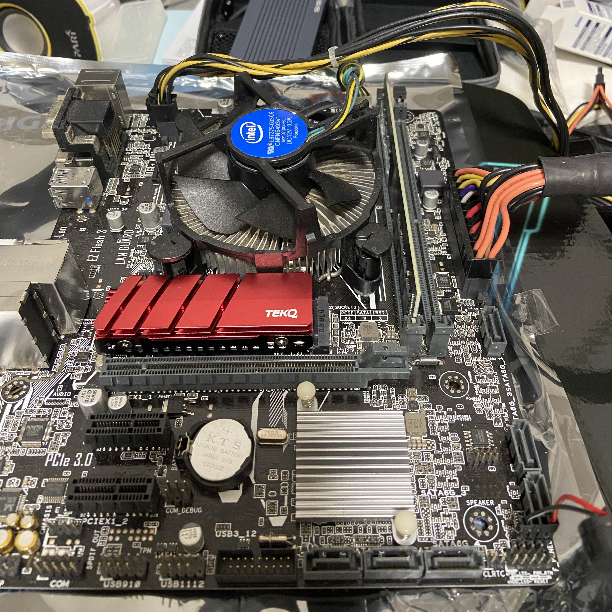
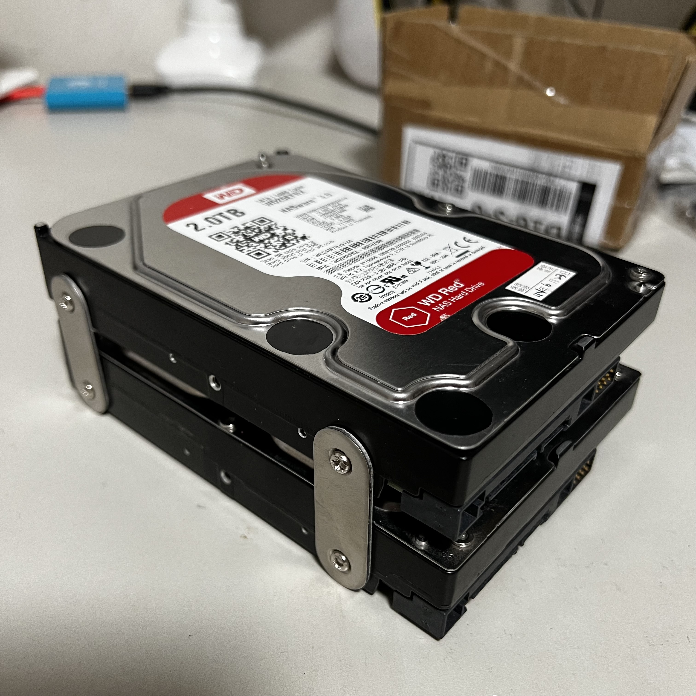
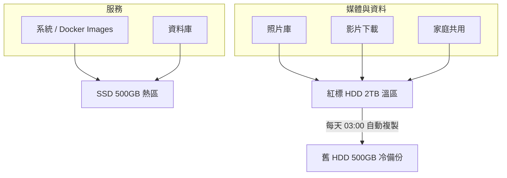
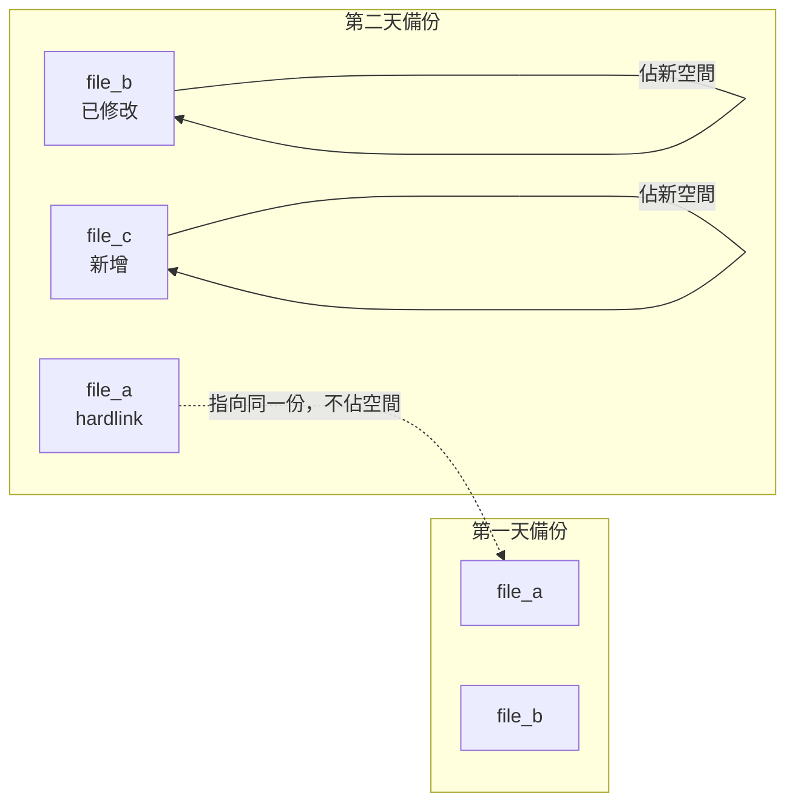

+++
date = '2026-05-05'
draft = false
title = '三塊硬盤的分工戰略：用老零件撐起一個 NAS'
description = '有限硬體、謹慎規劃、一個關於壽命與備份的選擇題'
tags = ['NAS', 'homelab', '備份', '硬體']
mermaid = true

[cover]
  image = 'nas-box.jpg'
  alt = '用老零件組成的 NAS 機箱'
+++

## 起點：一塊賣不掉的主機板

這台 NAS 的起點，是一塊想賣但沒賣出去的主機板。

年初升級到 i5-14400 之後，原本的 i7-7700 + B250M-K 就閒置了。照理說可以賣二手，但主板的PCIe卡扣有點瑕疵，不敢拿去賣，怕遇到奧客抓著不放。

正煩惱該怎麼清理空間時，突然靈光一閃，之前不是一直說要玩NAS嗎！現在板子跟 CPU 都有了，那顆一直被當普通資料碟用的 WD 紅標也可以轉行了，又去扒自組外接碟的 M.2 SSD ，再加上翻箱倒櫃挖出舊硬碟。

這拼裝車nas的零件也算湊齊了。



但 2026 才想玩 NAS 確實點尷尬。AI 把 NAND Flash 的供應鏈搞得一團亂，DDR5、SSD 跟海鮮一樣變成時價，HDD 也跟著亂漲。要買一組硬碟來玩也不是不行，就是荷包有點痛。

所以如果你也是「手邊剛好有幾顆舊硬碟」的人，這篇或許對你有用。

畢竟我的錢也不是大風刮來的，只能一開始就把每一顆盤放在對的位置上，讓它們儘量活久一點。這篇文章，就是我怎麼思考這件事的。

---

## 先說一個公司踩過的坑

我是跨行轉軟體開發的，在一間傳統產業轉型的小公司裡，部門沒有人能教這些東西，很多概念都是自己撞牆撞出來的。

一開始幫公司架服務，沒人告訴我要用 Docker，就直接在 VM 裡裝環境。

結果簡直一場災難。一台 VM 只能跑一種服務，多裝一個環境就開始打架；想在另一台機器重現，得從頭裝一遍；壞了沒辦法快速復原，只能挖之前的文件一步一步重來。

所以這次架 NAS，我的第一個決定就是：**所有服務都用 Docker Compose 包起來**。

這個決定跟硬碟策略是相關的。因為 Docker 讓我可以把「服務設定」跟「資料」分開放，而分開放，才能針對不同的資料特性選擇最適合的儲存位置。

---

## 三顆盤，三種角色

就三顆，沒得選。只能每一顆都用在最適合它的地方，不能浪費。



### SSD（500GB）：速度優先的熱區

系統、Docker images、還有資料庫，都放在 SSD。

為什麼資料庫也要在 SSD？有些人以為資料庫就像雲端硬碟一樣，只是個儲存空間。其實不是——資料庫會不斷讀寫資料，頻率非常高。HDD 太慢了跟不上。

而且重要的是：資料庫一跑，HDD 就被頻繁喚醒，根本無法休眠——每隔幾秒就要起來上班，完全停不下來。

HDD 持續旋轉 = 持續磨損 = 壽命縮短。這是我最不想看到的事。

那 SSD 頻繁讀寫不是也傷壽命嗎？確實。但差別在這裡：SSD 的讀寫壽命是可預測的，我們知道能撐多久；而 HDD 的機械磨損卻無法控制，一直旋轉就一直磨，反而更糟。

### 紅標 HDD（2TB）：容量優先的溫區

照片庫、影片下載、家庭共用資料夾，全部放在 HDD。

這些資料的特性很單純：寫進去，不常讀。用 SSD 是浪費，用 HDD 完全夠用。

這顆盤的妙處是可以 spindown ＝ 閒置時讓盤片停止旋轉。功耗從 8W 掉到不到 1W，機械磨損也歸零。

一天如果有 20 小時在休眠，一年大概省下 88 度電。硬碟壽命也至少延長一倍。

### 舊 PC HDD（500GB）：冷備份專區

這顆盤只做一件事：**備份**。

每天凌晨三點，自動把 `/data` 的內容複製過來（這個過程叫 rsync），保留最近七天的快照。

備份完就休眠，幾乎不動。這顆硬碟已經上萬小時，本來早該退休的，但用這個設計把它的壽命延長。維持在最低的讀寫壓力下，理論上還能用很久。



---

## 我曾經以為 RAID 是備份

剛開始在規劃架構的時候，我曾問過 AI：「我只有一顆2T，要不要再買一顆做 RAID 資料比較安全？」

然後被狠狠吐槽了一輪:

硬體圈有一句名言：「RAID is NOT a backup.」
它是為了「No down time」而存在的——你的盤壞了，另一顆頂上，用戶不會有感覺。

但如果你不小心刪了一個資料夾，兩顆盤會同步刪掉。一樣沒了。
或是主盤中毒，鏡像盤也會跟著中毒。根本同步召喚（誤。

我認真思考了三秒，我 NAS 停個幾天等蝦皮送新的好像也沒差。 玩 RAID 還要多買一塊盤、容量還砍半，對我來說確實有點盤。

所以我的方案就是老實的 rsync 快照備份，每天一份，留七天。

說到備份，「hardlink」這個技巧我也是第一次聽到。原以為備份七天聽起來要佔七倍空間。

但實際上沒有變過的檔案，第二天的備份不會複製一份新的，只是「指向」前一天那份的位置。幾乎不佔空間。

所以 500GB 對應 2TB 為什麼還夠？因為大部分檔案每天都沒變，只有新增或修改的檔案才會佔新空間。

我 500GB 的備份盤，輕鬆塞進七天完整快照。



主盤哪天真的掛了，找最近的快照復原就好。

---

## 跟 AI 協作的一個小心得

這整個架構，我幾乎都是跟 AI 討論出來的。

與AI協作有個技巧：要把背景交代清楚。

你只說「幫我規劃 NAS架構」，AI 給的東西太通用，難以符合實際狀況還浪費token。

所以直接告訴他，有什麼硬碟、想達到什麼效果、有什麼限制——這些都說出來，如果太長可以請AI寫一個.md檔清單。

AI 就像一個很厲害但什麼都不知道的工程師。你說得越具體，它給的方案越準。

所以下次問 AI 時，記住這個提問框架：

```
我有 [你的硬碟配置]，我想達到 [你的目標]，但我的限制是 [預算/空間/技術門檻]。
```

比如：

```
我有一顆 2TB HDD 想跑家庭服務，一顆 500GB 舊盤，我要自動備份且省電，但預算有限不想多買盤。
```

AI 這樣就懂了，能直接給你可以用的方案。

---

## 目前的狀況

這套東西已經跑了一個多月了。

每天凌晨默默備份，HDD 沒人用的時候就休眠，SSD 讓服務用起來就像app一樣流暢自然，這大概就是「各司其職」吧——不需要一直去管它。
