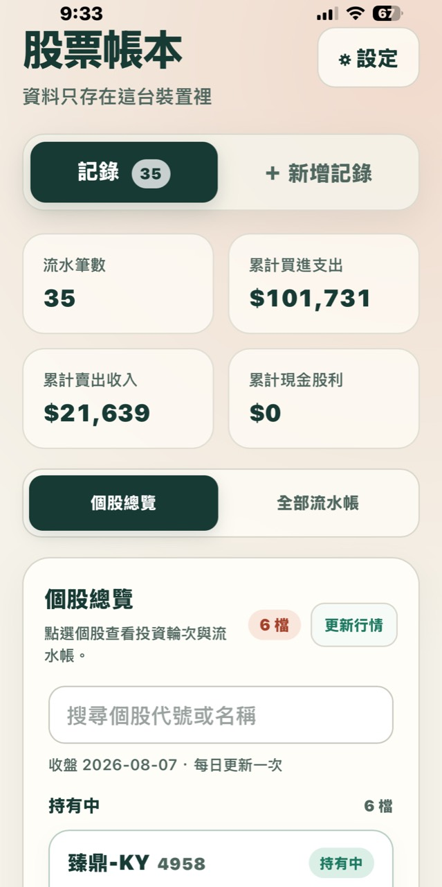
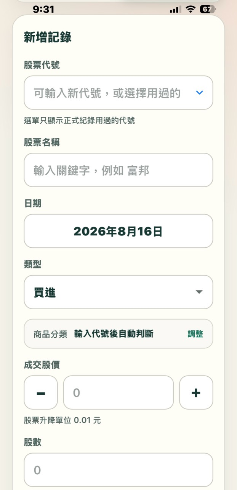
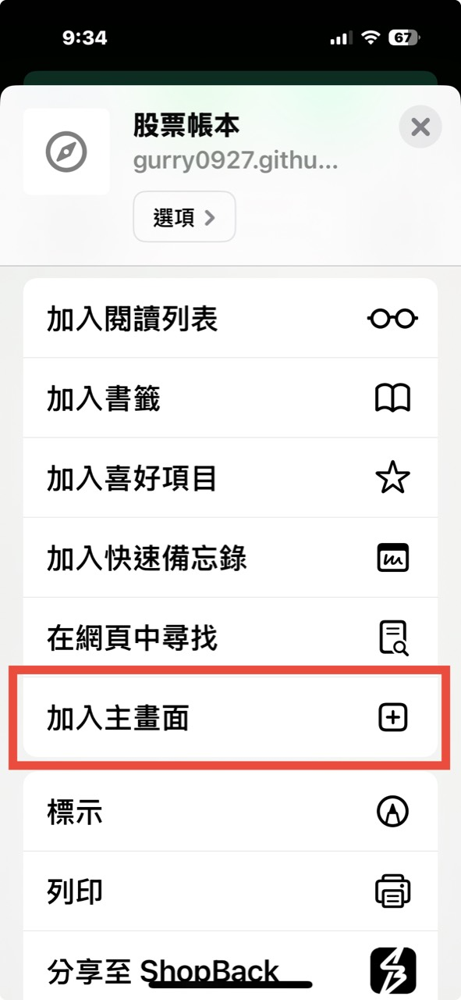

+++
date = '2026-08-16'
draft = false
title = '台股離線股票帳本'
description = '一個自己做、和 AI 一起調整出來的台股記帳小工具。不用註冊、不用伺服器，資料存在你自己的裝置裡。'
tags = ['工具', '股票記帳', '台股', '離線網頁', 'AI協作', '小工具']
keywords = ['台股記帳', '股票記帳', '股票帳本', '離線記帳', 'IndexedDB', '手機股票記帳']
ShowReadingTime = false
ShowShareButtons = true
ShowPostNavLinks = false
ShowBreadCrumbs = true
ShowToc = true
TocOpen = false
+++

這是一個我自己做來記台股的小工具。

它不是投資服務，也不是什麼專業財務系統。比較接近：我自己在手機上記股票時，覺得一般記帳 App 和試算表都不太順手，所以和 AI 一起把一個簡單的離線網頁慢慢磨出來。

  <a class="tool-button primary" href="https://gurry0927.github.io/stock-ledger/">立即使用</a>
  <a class="tool-button" href="https://github.com/gurry0927/stock-ledger">GitHub 原始碼</a>
  <a class="tool-button" href="https://github.com/gurry0927/stock-ledger/issues">回報問題</a>

## 畫面預覽

  <figure class="screenshot-card">
    
    <figcaption>個股總覽</figcaption>
  </figure>
  <figure class="screenshot-card">
    
    <figcaption>新增紀錄</figcaption>
  </figure>
  <figure class="screenshot-card">
    
    <figcaption>加入主畫面</figcaption>
  </figure>

## 它在解決什麼

我想要的是一個很小、很直接的股票帳本：

- 手機打開就能新增紀錄
- 可以記買進、賣出、配息、配股、減資、分割
- 可以看個股總覽，也可以看全部流水帳
- 可以用 CSV 匯出備份，換手機或清除瀏覽器資料時比較安心
- 不需要登入，也不需要把資料交給別人的伺服器

所以它現在就是一個 HTML 小工具，放在 GitHub Pages 上。第一次打開需要網路；開過之後，手機瀏覽器會把它快取起來，比較接近「加到桌面的小 App」。

## 隱私和資料

這點是我很在意的。

你的記帳資料只存在你自己的瀏覽器裡，使用的是 IndexedDB。也就是說：

- 我看不到你的交易紀錄
- GitHub Pages 看不到你的帳本內容
- 沒有帳號，也沒有雲端同步
- 換手機、清除 Safari 資料、換瀏覽器之前，請先匯出 CSV

這種做法的好處是乾淨、單純、隱私感比較好。缺點也很誠實：資料備份要靠你自己記得做，沒有登入救援，也沒有跨裝置同步。

## 目前能做的事

- 設定手續費折扣、整股最低手續費、零股最低手續費
- 估算買賣交易費用與賣出證交稅
- 輸入股票代號或名稱，帶出常見台股、ETF、KY 股名稱
- 依股票整理持股狀態與投資輪次
- 配息、賣出收入、現金減資可以反映在回本成本上
- 匯出與匯入 CSV
- 內建可刪除的示範資料，方便第一次打開時試玩

費用和稅金都是估算，實際金額還是以券商對帳單為準。如果你遇到金額差一兩元、或某家券商規則比較特別，也歡迎回報。

## 適合誰

我覺得它適合這幾種人：

- 有在買台股或 ETF，想自己留一份簡單紀錄
- 不想為了小小的記帳需求再註冊一個服務
- 不想把持股資料放到陌生 App 或雲端
- 覺得 Excel 可以，但在手機上操作有點卡
- 想看一個 AI 協作做出來的小工具可以長成什麼樣子

它不適合拿來當正式報稅、公司帳務、投資建議或券商對帳替代品。這點我先說清楚，工具小小的，肩膀也不要硬扛太多東西。

## 第一次使用教學

點「立即使用」打開工具後，可以先用示範資料玩一輪。它會放一些假的買進、配息、賣出紀錄，讓你知道個股總覽、流水帳和投資輪次大概怎麼看。

### 清掉示範資料

示範資料只是拿來試玩的，不會匯出到 CSV，也不會混進正式紀錄。

如果你準備開始記自己的股票，可以打開「設定與備份」，找到「操作示範資料」，按「刪除全部示範」。刪完之後，畫面就會回到乾淨狀態。

### 匯出 CSV 備份

資料只存在目前這台裝置，所以偶爾匯出 CSV 很重要。尤其是換手機、清 Safari 資料、或換瀏覽器之前，建議先備份一次。

在「設定與備份」裡按「匯出 CSV」，瀏覽器會產生一個備份檔。你可以把它存在 iCloud Drive、傳到自己的 LINE、或放到任何你習慣保管檔案的地方。

小提醒：CSV 裡會有你的記帳內容，傳到 LINE 或雲端之前，等於是把這份備份交給那個服務保管。方便和隱私要自己取捨一下。

### 匯入 CSV 搬資料

換手機或換瀏覽器時，可以先在舊裝置匯出 CSV，再到新裝置打開工具，進「設定與備份」選擇那個 CSV 檔匯入。

匯入是合併方式，不會先清空現有資料；相同 ID 的紀錄才會更新。如果 CSV 有格式錯誤，工具會整份擋下來，不會寫一半進去，這樣比較不容易把帳本弄亂。

### 加到手機桌面

如果是在 iPhone 上，建議用 Safari 打開工具頁，再按分享按鈕，選「加入主畫面」。

之後它會像一個小 App 一樣出現在手機桌面。打開時比較少瀏覽器網址列和按鈕的干擾，用起來會安靜很多，也比較像真正的記帳工具。

## 原始碼和回饋

原始碼放在 GitHub：

[https://github.com/gurry0927/stock-ledger](https://github.com/gurry0927/stock-ledger)

如果你願意幫忙測試，最有用的回饋通常是這幾種：

- 哪個地方看不懂
- 手機上哪裡不好按
- 哪個交易情境算出來和券商不同
- CSV 匯入匯出有沒有踩到問題
- 你覺得它還缺哪個「真的會每天用」的小功能

這個工具還在很早期，但如果剛好也符合你的用法，歡迎拿去玩玩看。
