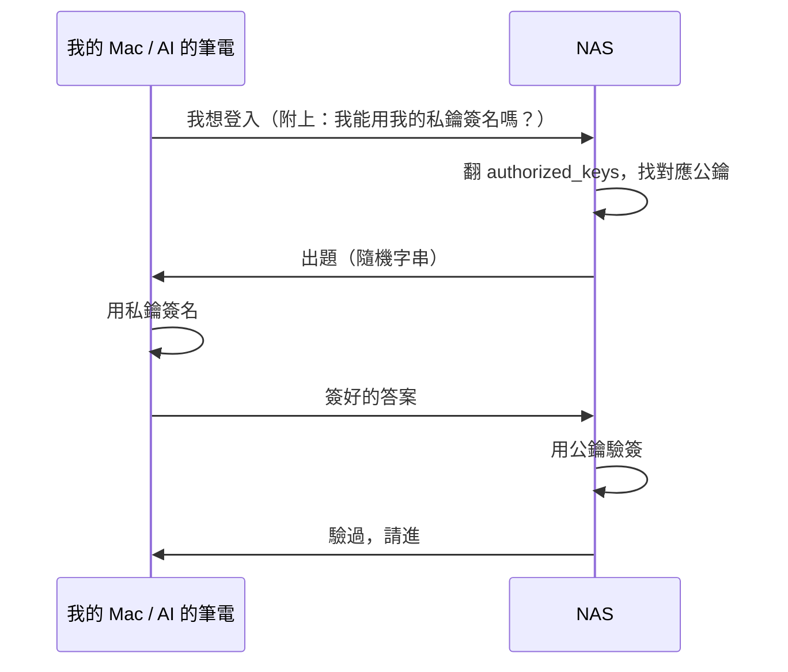

# #2 SSH Key 是什麼：我給 AI 一把家裡的鑰匙

> 草稿狀態：大綱（段落結構 + 素材對照）
> 預定 slug：`ssh-key` → `content/posts/ssh-key/index.md`
> 風格：延續第一篇〈三塊老硬碟的分工戰略〉的小白＋故事＋AI 協作調性

## Front matter（草擬）

```toml
title = '【小白篇】SSH Key 是什麼：我給 AI 一把家裡的鑰匙'
description = '一份只有兩行的白名單，一個關於信任、鎖、與遠端代理人的故事'
tags = ['NAS', 'homelab', 'SSH', 'AI協作', '小白篇', 'Linux']
```

## 鉤子（開場第一段就要砸出來）

直接秀 `cat ~/.ssh/authorized_keys` 末段——只給看兩行的 comment：

```
ssh-ed25519 AAAA...省略... gurry@MacBookAir.home
ssh-ed25519 AAAA...省略... ClaudeCode@GakePC
```

第一行：我的 Mac。
第二行：我的 AI。

「上一篇我說我跟 AI 討論架構——但 AI 是怎麼真的進到 NAS 裡幫我看資料夾、改檔案的？答案就在這份只有兩行的白名單。」

→ 這就是把第一篇結尾「AI 協作」從抽象變物理的瞬間。整篇文章就靠這個鉤子撐起來。

---

## 段落結構（暫定七段）

### 段 1｜兩把鑰匙
- 開場鉤子（上面那段）
- 銜接第一篇：上次講「跟 AI 討論」很抽象，這篇講具體怎麼讓它「進門」
- 預告：要回答三個小白問題

### 段 2｜先換個比喻：密碼是「你知道的」，鑰匙是「你擁有的」
- 一般人想到登入＝輸入密碼
- SSH key 換成另一個機制：一對「公鑰／私鑰」
- 比喻：authorized_keys 是門上的鎖（它記得這把鑰匙的形狀），私鑰是你口袋裡的鑰匙
- 公鑰可以大方丟給朋友看，沒對應的私鑰也打不開
- 這是「對稱（密碼）vs 非對稱（金鑰對）」的小白譯法，但**不要用對稱／非對稱這種詞**，用比喻講完

### 段 3｜三個小白問題（這段最重要，是文章的肉）

直接列成 Q&A 形式，但用敘事腔不要冷冰冰：

**Q1：「禁用密碼登入之後，sudo 還要密碼嗎？」**
- 答：SSH 密碼跟 sudo 密碼是兩條獨立的軌道
- 比喻：進家門用鑰匙，但進來之後想動主臥的保險箱、還是要主人輸入保險箱密碼
- 所以 NAS 上 `sudo apt update` 還是會問密碼，那是另一道牆

**Q2：「為什麼有 SSH key 就能免密碼？」**
- 答：NAS 的 `~/.ssh/authorized_keys` 是一份白名單
- 你的公鑰寫在上面 → 你手上的私鑰就能開門
- 名單沒你 → 一輩子別想進來

**Q3：「那不是很危險？誰都能拿 key 進來？」**
- 答：白名單**你**控制
- 想撤一把 key？刪那一行就好
- 真正要小心的是「私鑰本身被偷」——所以 Mac 用 Keychain、ssh-agent 鎖在系統層

→ 這三個 Q 是 CONTENT_PLAN 直接搬過來的，因為它們是真實小白會卡住的點。

### 段 4｜回到那兩行：第二行就是 AI 的手
- 把 ClaudeCode 那把 key 拉出來特寫
- 這把是我自己生的（在 ClaudeCode CLI 那台筆電上 `ssh-keygen`），公鑰自己貼進 authorized_keys
- 從此我跟 AI 說「幫我看看 NAS 上 docker compose 結構」，它真的能 ssh 進來看
- 寫的時候要描述那種感覺：你不是在「指揮 AI 寫指令給你 copy」，AI 是真的在 shell 裡操作
- 這把 key 我可以隨時撤——從 authorized_keys 刪一行，AI 就被踢出門
- 信任不是 binary 而是可撤回的

→ 這段是全篇情感重心。文學調性可以拉一點：像把鑰匙交給一個「不是人但能像人一樣幹活」的合作者。

### 段 5｜順手把密碼登入關掉
- 既然有 key 就用不到密碼，那條路乾脆關掉
- 實際素材：`/etc/ssh/sshd_config.d/99-security.conf` 的兩行
  ```
  PasswordAuthentication no
  PermitRootLogin no
  ```
- 為什麼要做：全世界有一堆腳本一秒幾百次掃 22 port 試弱密碼，把這條路關掉等於門不接受任何敲門聲
- ⚠️ 安全提醒：**先**確認 key 進得來、**再**把密碼關掉。順序反了會把自己鎖在門外
- 這段不展開太深（UFW、fail2ban 是下下篇〈安全加固〉的料），點到為止

### 段 6｜（可選）AI 把這把 key 用來做什麼
- 真實舉例：探勘整個 NAS 結構、寫這個 blog 的時候掃環境找素材、半夜備份失敗時診斷 log
- 不是「AI 替我幹活」，是「AI 跟我一起住在這台機器上」
- 帶出第三篇預告：但 AI 住進來了，要怎麼讓它不亂搞？需要一份「家規」

### 段 7｜結尾：鑰匙的哲學
- 密碼是「我記得的東西」——會忘、會洩、會被猜
- 鑰匙是「我擁有的東西」——丟了就撤掉重發、可分發給不同人不同把
- 把鑰匙交給 AI 是這套邏輯的延伸：信任不必綁定身分，只要綁定一把可撤回的物件
- 預告下一篇：〈NAS 憲法〉——光給鑰匙不夠，還要寫一份說明書，AI 才知道家裡哪些地方不能碰

---

## 實際素材清單（對照環境探勘）

| 段落 | 用什麼真實素材 |
|---|---|
| 段 1 鉤子 | `~/.ssh/authorized_keys` 的兩行 comment（不洩 key 本體） |
| 段 3 Q3 | macOS Keychain / ssh-agent（一句帶過即可） |
| 段 4 | ClaudeCode 那把 key 的故事——它是怎麼生出來、怎麼被加進來的 |
| 段 5 | `/etc/ssh/sshd_config.d/99-security.conf` 的兩行 |
| 段 7 | 串到第三篇〈NAS 憲法〉的 INFRA.md |

## 視覺素材建議

- **封面**：抽象一點——一把鑰匙、或是一個門鎖的特寫，避免硬體照（前一篇用了硬體照）
- **內文圖**：可選——不一定要圖，這篇文字感比較重；如果要放，放一張 `cat authorized_keys` 的終端截圖，或一張 mermaid 流程圖（公鑰／私鑰怎麼配對）
- **mermaid 候選**：



（這張圖比文字更好懂「不需要傳密碼也能驗身份」這件事）

---

## 已定案

1. ✅ **標題**：「【小白篇】SSH Key 是什麼：我給 AI 一把家裡的鑰匙」
2. ✅ **視覺**：用 mermaid，不放 `cat authorized_keys` 截圖（mermaid 對未來數位雙生語料有幫助，截圖到時候沒辦法被文字索引）
3. ✅ **段 6 寫**（每段 3–4 句，不展開技術細節）
4. ✅ **發文時機**：先累積草稿不排程，commit 時再決定日期

---

## 不寫進這篇的（避免失焦）

- ❌ ssh-keygen 怎麼下指令（小白文不該變 tutorial）
- ❌ ed25519 vs RSA 演算法選擇
- ❌ UFW、fail2ban、port 22 改 port（留給〈安全加固〉那篇）
- ❌ Tailscale 怎麼用（留給〈Tailscale 入門〉那篇）
- ❌ 多台機器 key 同步、ssh config 別名（太工程師向）
