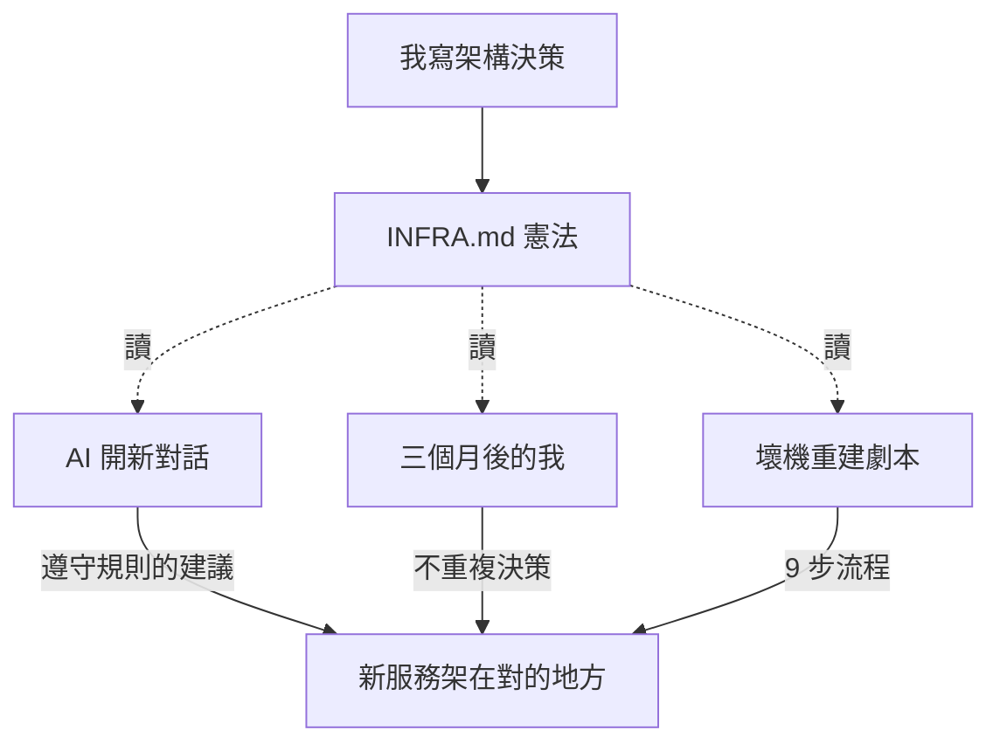

# #3 NAS 憲法：寫一份說明書，讓 AI 不會把家拆了

> 草稿狀態：大綱（段落結構 + 素材對照）
> 預定 slug：`nas-constitution` → `content/posts/nas-constitution/index.md`
> 接續：#2〈SSH Key〉結尾「AI 進來了要怎麼讓它不亂搞」

## Front matter（草擬）

```toml
title = '【小白篇】NAS 憲法：寫一份說明書，讓 AI 不會把家拆了'
description = '一份不會忘記的家規，給三個月後的自己、給每次新開對話的 AI'
tags = ['NAS', 'homelab', 'AI協作', 'INFRA.md', '小白篇', '架構']
mermaid = true
```

## 鉤子（開場第一段就要砸出來）

直接引用 INFRA.md 開頭那句：

> 「這份文件是 NAS homelab 的唯一真實來源。壞了就照這裡重建。」

「這是我 NAS 上一份叫 `INFRA.md` 的檔案的第一行。297 行，列了硬體規格、磁碟配置、6 條『不』字規則、9 步壞機重建 SOP。

它不是註解、不是 README。它是這台 NAS 真正的憲法——比我腦袋可靠、比我心情穩定、是我跟 AI 共同的記憶體。」

→ 鉤子的力量：讓讀者意識到「文件不是寫給人看，是基礎設施本身」。

---

## 段落結構（暫定七段）

### 段 1｜開場那句宣言
- 引用 INFRA.md 開頭
- 銜接 #2：上一篇給 AI 鑰匙了，這篇要寫一份家規讓它知道哪裡不能亂踩
- 預告：憲法不是抽象概念，是一份**真的存在**的 297 行 markdown

### 段 2｜為什麼需要憲法（兩個小故事）

故事一：**你三個月後會忘記**
- 我為什麼把 Immich 的 PostgreSQL 放 SSD 而不是 HDD？
- 三個月前的我有想清楚原因（HDD 不能 spindown、效能差），三個月後的我只記得「好像有原因」
- 沒寫下來的決策＝沒做的決策

故事二：**AI 每次都是新人入職**
- 跟 AI 開新對話 = 它從零開始
- 你不講清楚，它就用「最普遍的做法」給你建議——而你要的是**你的做法**
- 第一次它建議我「PostgreSQL 用 Docker volume 預設位置」，但我的設計是放 `/opt/immich/postgres/`
- 不是 AI 笨，是它沒拿到地圖

→ 結論：憲法解決的是兩種失憶——**未來的我**和**新對話的 AI**。

### 段 3｜憲法長什麼樣（現場拉三段）

不要把整份 INFRA.md 貼出來，挑三段最有代表性的：

**(a) 硬體與磁碟配置表** — 一張表交代「這台機器是誰」
（pull L11-17 + L23-27 的精華，可改寫成更短的版本）

**(b) Volume 放置原則** — 接第一篇硬碟分工的「規則化」
| 類型 | 放哪 | 原因 |
|---|---|---|
| DB / PostgreSQL | `/opt/<service>/` (SSD) | 效能，HDD 無法 spindown |
| 媒體 / 上傳檔案 | `/data/<service>/` (HDD) | 容量大，不需要高 IOPS |
| compose / 設定 | `/data/services/<service>/` | 隨 rsync 備份 |

→ 這張表是〈三塊老硬碟〉那篇結論的「規則化版本」，把感性決策變理性條文。

**(c) 6 條「不」字規則** — 全文最重要的清單，整段引用：
> - 不在 `/data` 根目錄直接放散落的檔案
> - 不直接修改 `/backup/` 的內容
> - 不把服務的 DB 放在 HDD（效能差，且 HDD 無法 spindown）
> - 不在系統層 `apt install` 安裝服務，能 Docker 就 Docker
> - 不把 secrets 寫進 `docker-compose.yml`，放 `.env`
> - 不把整個 `/data` 開放給 Samba，只開放必要的子目錄

每一條都有踩過的坑，但**不要全展開**——挑兩條當代表（建議：第三條接第一篇，第四條接後面 code-server 例外故事），其他的留給未來文章補。

### 段 4｜規則的例外：code-server 跟 Windows VM

- 第四條規則：「不在系統層 `apt install` 安裝服務，能 Docker 就 Docker」
- 但 NAS 上有兩個明顯的破例：

**例外一：code-server 跑 systemd user 服務**
- 它要存取家目錄、要載入各種開發工具鏈、要頻繁 reload
- 硬包 Docker 反而違反這條規則的**精神**：「讓服務好維護」
- 用 Docker 弄它要解決一堆怪問題（home mount、權限、port、reload 鏈）——複雜度暴增，能省下的東西卻很少

**例外二：Windows 11 VM 跑在 KVM**
- 你不可能把 Windows 包進 Docker——VM 跟容器是兩種不同的東西，原理上就做不到
- VM 是「整台虛擬電腦」，Docker 是「共用核心的隔離程序」
- 強行硬塞會違反 Docker 設計的初衷

**這兩個例外背後的同一個道理**：規則是寫來服務目的的，不是反過來
- 「能 Docker 就 Docker」的目的是「讓服務統一管理、好備份、好重建」
- 當套用規則本身會破壞這個目的時，破規則才是正確答案

→ 這段非常重要。它告訴讀者：寫憲法不是要把自己關在框框裡，是讓你知道「破例」的時候在破**什麼精神**。沒規則就沒例外，只有混亂。

### 段 5｜AI 怎麼讀這份憲法

- 接 #2：鑰匙讓 AI 進來，憲法讓它做對事
- 實際做法（不要寫成 tutorial，但要具體）：
  - 開 ClaudeCode 新對話時，第一件事就是「請先讀 `/data/services/nas-dashboard/INFRA.md`」
  - 它讀完，就懂這台機器的所有規則
  - 接下來它建議的任何架構，都會跟我三個月前的設計**不打架**
- 對比：沒餵 INFRA.md 時 AI 給的建議 vs 餵了之後給的建議
  - 沒餵：「把資料放 `/var/lib/postgresql/`」
  - 餵了：「按你的規則放 `/opt/<service>/`，因為你的 SSD 是 NVMe，HDD 不能 spindown」
- 這段是全篇最有「AI 協作」實感的段落

### 段 6｜壞機重建 SOP：文件即基礎設施的終極考驗

- INFRA.md 結尾有 9 步重建 SOP
- 我自己也記不住——重灌 Ubuntu → 掛硬碟 → 裝 Docker → Tailscale → 拿回 .env → 起服務 → 接 Cloudflare → 恢復 cron
- 但 INFRA.md 記得
- 換句話說：**這份文件本身就是一份「我不在了的時候 NAS 怎麼活下去」的劇本**
- 很形而上的一個感覺：你寫文件不是為了現在，是為了那個你不在場的時刻
- 點到為止，重建的細節留給 #11〈壞機不怕：5 小時重建〉那篇

### 段 7｜結尾：憲法的「第 0 條」

- INFRA.md 沒明寫的一條：**選對地基**
- 為什麼是 Ubuntu Server，不是 TrueNAS / Unraid？
- 為什麼用 Tailscale，不開 port forwarding？
- 這些更基礎的選擇，是憲法寫得出來的前提
- 預告 #4〈為什麼選 Ubuntu Server〉：憲法的地基

收尾調性：「文件不是寫給看的，是寫給不在場的自己跟 AI 看的。每一條規則都是一份不會忘的記憶。」

---

## 實際素材清單（對照環境探勘）

| 段落 | 用什麼真實素材 | 來源 |
|---|---|---|
| 段 1 鉤子 | INFRA.md 第 3 行宣言 | [/data/services/nas-dashboard/INFRA.md:3](/data/services/nas-dashboard/INFRA.md#L3) |
| 段 3a | 硬體與磁碟表 | INFRA.md L11-27 |
| 段 3b | Volume 放置原則 | INFRA.md L62-68 |
| 段 3c | 6 條禁止事項 | INFRA.md L192-197 |
| 段 4 | code-server systemd user 例外 | INFRA.md L207 |
| 段 5 | INFRA.md 整份作為 AI context | 對話實例（可虛構或半實錄） |
| 段 6 | 9 步重建 SOP | INFRA.md L254-286 |

## 視覺素材建議

- **封面**：抽象一點，「規則」「藍圖」「家規」的意象。或者 INFRA.md 在 VS Code 裡的截圖（碼掉 Tunnel ID 之類敏感欄位）也可以——這個視覺強，但牽涉到敏感資訊處理
- **內文 mermaid 候選**：



→ 這張圖把「文件 = 三個讀者的共同記憶體」視覺化（未來的我、AI、重建情境）

## 已定案

1. ✅ **公開 INFRA.md 內容**：但不引用原文，全部用「我的版本」重述（敏感欄位天然不會出現）
2. ✅ **段 4 例外故事用 B**：半段展開，並把 **Windows VM** 也納入當第二個例外，讓 code-server 從個案變成「規則例外的 pattern」
3. ✅ **段 6 壞機重建 SOP 用 B**：露 9 步的標題，不展開細節
4. ✅ **預告 #4**：三部曲感更強

---

## 不寫進這篇的（避免失焦）

- ❌ INFRA.md 怎麼寫（教學調性）
- ❌ 完整壞機重建步驟（→ #11）
- ❌ 各服務的 docker-compose 細節（→ 各服務介紹篇）
- ❌ Cloudflare Tunnel 怎麼設定（→ 後續網路篇）
- ❌ Supabase Auth 細節（→ #16）
- ❌ 「為什麼選 Ubuntu Server」展開（→ #4，只在結尾預告）

---

## 與 #2 / #4 的串連檢查

**從 #2 接過來**：#2 結尾是「給 AI 鑰匙了，但怎麼確保它不會亂搞？」→ #3 開場直接答「寫憲法給它看」。順。

**接到 #4**：#3 結尾預告「憲法的地基是 OS 選擇」→ #4 開場「我為什麼選 Ubuntu Server，不選 TrueNAS / Unraid」。順。

**回顧 #1**：#3 段 3b（Volume 放置原則）會直接引用 #1 的硬碟分工，讓老讀者有「啊那篇講的東西被規則化了」的滿足感。
