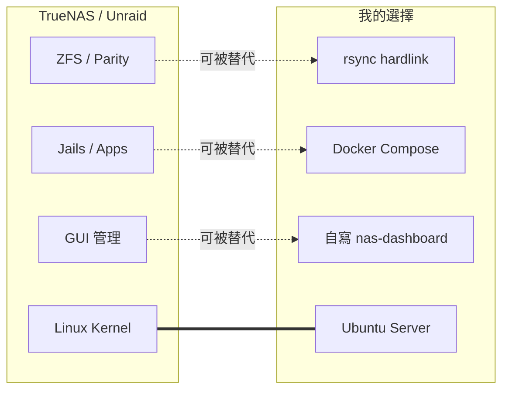

# #4 為什麼選 Ubuntu Server，不選 TrueNAS / Unraid

> 草稿狀態：大綱（段落結構 + 素材對照）
> 預定 slug：`ubuntu-server` → `content/posts/ubuntu-server/index.md`
> 接續：#3〈NAS 憲法〉結尾「憲法的第 0 條：選對地基」

## Front matter（草擬）

```toml
title = '【小白篇】為什麼我選 Ubuntu Server，不選 TrueNAS / Unraid'
description = 'NAS OS 不選最好的，選最熟的——對我跟 AI 都熟的'
tags = ['NAS', 'homelab', 'Ubuntu', 'TrueNAS', 'Unraid', 'AI協作', '小白篇']
mermaid = true
```

## 鉤子（開場第一段就要砸出來）

「上一篇我說 NAS 憲法是這台機器的家規。但家規寫在哪種地基上？

NAS OS 圈有三條路：TrueNAS、Unraid、Ubuntu Server。前兩個是『NAS 專用 OS』，第三個是『一般 Linux 伺服器』，要自己什麼都動手。

你大概以為我會選前兩個——畢竟『專用』聽起來比較專業。但我選了第三個。理由很無聊：**我選的不是最好的，是最熟的**——對我熟、對 AI 也熟。」

→ 這個鉤子的力量：直接挑戰小白的直覺（專用 OS 比較好），用「最熟而非最好」的反差勾住人。

---

## 段落結構（暫定七段）

### 段 1｜開場：地基也是設計決策
- 接 #3 憲法的「第 0 條」
- 預告：今天講選 OS 這件事比想像中政治
- 拋出主題句：「我選的不是最好的，是最熟的」

### 段 2｜NAS OS 圈的三選一（小白導覽）

用一張對照表給完全沒概念的讀者一個地圖：

| | TrueNAS | Unraid | Ubuntu Server |
|---|---|---|---|
| 定位 | NAS 專用 OS | NAS 專用 OS（半商用） | 一般 Linux 伺服器 |
| 賣點 | ZFS 自我修復、企業級可靠 | Parity 容錯、混合容量硬碟 | 自由、什麼都自己組 |
| 介面 | 漂亮 Web UI | 漂亮 Web UI | 黑黑的終端機 |
| 費用 | 免費 | 約 $59 USD 起跳的授權 | 免費 |
| 對小白 | 友善但要遷就它的設計 | 最友善 | 不友善（要自己上） |

→ 這張表不要花太多筆墨——小白讀一眼有概念就好。重點是後面的「為什麼我選那個不友善的」。

### 段 3｜小白會被前兩個吸引的三個理由（誠實面對）

不要假裝 TrueNAS / Unraid 不好——它們真的有優勢：

1. **ZFS 的 self-heal**（TrueNAS 的招牌）：
   - 它能偵測「位元腐敗」（bit rot）並自動修復
   - 對長期保存照片是真的有用——爺爺奶奶的數位遺物不會默默壞掉
2. **Parity 的混合容量**（Unraid 招牌）：
   - 你可以用一顆 4TB + 一顆 2TB + 一顆 1TB 組成容錯陣列
   - 對「家裡剛好有幾顆不同大小的舊硬碟」完美契合（**直接呼應 #1 的開場！**）
3. **GUI 設定一切**：點一點就能加共享、開服務、設備份排程

→ 寫到 Parity 那條時可以自嘲：「對，我看到的時候真的有心動三秒」，誠實的態度反而讓後面的「但我還是選 Ubuntu Server」更有重量。

### 段 4｜我選 Ubuntu Server 的兩個「熟」

**熟之一：對我熟**
- 我跨行進軟體後第一份工作就是在 Ubuntu 上架服務
- 不是「會用」，是「肌肉記憶」——`apt`、`systemctl`、`journalctl` 是我的母語
- 換 TrueNAS 等於換語言——它有自己的 plugin 系統、自己的設定哲學
- 對小白可能是好事，但對已經會走路的人，學「不一樣的走法」是負擔

**熟之二：對 AI 熟**
- 這是現代才出現的選擇標準，但**真的會影響日常**
- AI 訓練語料裡 Ubuntu 是 default
- 跟 AI 說「Ubuntu Server 怎麼做 X」→ 它直接給你答案
- 跟 AI 說「TrueNAS Scale 怎麼做 X」→ 它會猶豫、會給通用 Linux 答案、會建議你查官方文件
- AI 對 Ubuntu 不需要 context；對 TrueNAS 需要——而 context 就是 token 跟時間
- 這條規則延伸到任何 AI 協作的場景：**選擇主流，AI 才能無縫接手**

→ 這段是全文的中心思想。把「對 AI 熟」這個現代才存在的選擇標準直接命名出來，是這篇能跟其他 NAS OS 比較文不一樣的地方。

### 段 5｜全用 Docker = 我用不到 NAS OS 的特殊功能

- TrueNAS 的招牌功能（Jails、Apps、ZFS dataset 對應 Docker volume）我都用 **Docker Compose** 取代了
- Unraid 的招牌（Parity、Mover）我用 **rsync hardlink + 三盤分工** 取代了（呼應 #1）
- 等於買了一雙登山鞋只用來走平地——專用設計浪費掉
- 反過來說：當你決定「全用 Docker」，你就把 NAS OS 那層特殊性架空了
- 剩下的問題就只是「哪個 Linux 跑 Docker 最順、最熟」——答案就是 Ubuntu

### 段 6｜誠實面對失去的東西

不寫這段文章會看起來像鼓吹——寫了會更可信：

- ❌ 沒有漂亮 GUI——所以我自己寫了 nas-dashboard（→ 第 #12 篇會聊）
- ❌ 沒有 ZFS 的 self-heal——bit rot 我認了，照片用 Immich + Samba 雙存放部分緩衝
- ❌ 沒有 Parity——我用 rsync 7 天 snapshot，能應付**人為失誤**但不能應付**硬碟突然 bad sector**
- ❌ 設定全都自己來——學習曲線陡，但學會了什麼都能做

→ 這段的關鍵是「對 trade-off 的覺察」。讀者看到的不是炫耀，是清醒。

### 段 7｜結尾：「最佳」vs「最熟」

- 大部分技術選擇沒有「最好」，只有「最適合你當下」
- 適合的標準裡，「熟」常常被低估——人們追新、追酷、追 hype
- 但**熟讓你做決策快、debug 快、跟 AI 協作快**
- 「最熟」的紅利是複利的——你越熟、越多事在這個地基上能跑、就越熟
- 預告 #5 Tailscale：「選對 OS 還只是地基；AI 跟我要怎麼走進這個地基，是下一篇的事」

收尾調性：「地基不是越強越好，是越熟越好。熟的地基讓你能蓋出別人蓋不出的房子。」

---

## 實際素材清單（對照環境探勘）

| 段落 | 用什麼真實素材 |
|---|---|
| 段 1 | INFRA.md 第 1 行（labserver 是這台機器的名字） |
| 段 2 表格 | 三個 OS 的客觀對照（部分基於常識，不需 NAS 內部資料） |
| 段 3 第 2 點 | 直接呼應 #1〈三塊老硬碟〉的開場 |
| 段 4 「對我熟」 | 用戶自身經歷：跨行軟體開發、公司 VM 架服務（呼應 #1 段 2） |
| 段 4 「對 AI 熟」 | 真實協作經驗——你跟我（ClaudeCode）就是用 Ubuntu 命令在搞的 |
| 段 5 Docker 取代 | INFRA.md 整份 docker-compose 標準結構（→ #3 段 3） |
| 段 5 rsync 取代 | 第一篇 hardlink 那段 |
| 段 6 nas-dashboard | INFRA.md 對外服務表（nas.gakes.net） |

## 視覺素材建議

- **封面**：抽象一點。「地基」「熟悉的工具」「終端機 vs GUI」的對比視覺。如果硬要具體，可以放一張你的 terminal screenshot（碼掉敏感的 hostname/IP）
- **mermaid 候選**（段 5 的「Docker 架空 NAS OS 特殊性」視覺化）：



→ 這張圖把「特殊功能可以被通用工具組裝出來」視覺化

## 已定案

1. ✅ 不展開檔案系統取捨（段 6 一句帶過「沒有 self-heal」）
2. ✅ 不提 NixOS / Proxmox（保持三選一焦點）
3. ✅ 段 4「對 AI 熟」整段寫透
4. ✅ 標題用 A：「【小白篇】為什麼我選 Ubuntu Server，不選 TrueNAS / Unraid」（直白優先）

→ 1、2 提到的概念另外整理在 [drafts/_concepts.md](_concepts.md) 給用戶補課用

---

## 不寫進這篇的（避免失焦）

- ❌ Ubuntu Server 怎麼裝（→ 操作教學文，不適合小白思考類）
- ❌ Btrfs / ZFS / ext4 詳細比較（→ 檔案系統專文）
- ❌ Tailscale 怎麼設（→ #5）
- ❌ Docker Compose 教學（→ 未來 Docker 是什麼那篇）
- ❌ nas-dashboard 細節（→ #12）

---

## 與 #3 / #5 的串連檢查

**從 #3 接過來**：#3 結尾預告「憲法的第 0 條：選對地基」→ #4 開場直接答「地基就是 OS 選擇」。順。

**接到 #5 Tailscale**：#4 結尾「選對 OS 還只是地基；AI 跟我要怎麼走進這個地基」→ #5 開場「Tailscale：不開公網就能進來」。順。

**回顧 #1**：段 3 「Parity 的混合容量適合家裡舊硬碟」直接呼應 #1 開場「翻箱倒櫃挖出舊硬碟」——讓老讀者覺得「啊我也有過這個誘惑」。

**整個三部曲檢查**：
- #2：給 AI 一把鑰匙進來
- #3：給 AI 一份家規（INFRA.md）
- #4：給 AI 一個它最熟的家（Ubuntu Server）
→ 「鑰匙 → 家規 → 家本身」由近到遠的因果鏈。讀者看完三篇能感覺到「AI 協作」不是嘴砲，是一整套設計。
